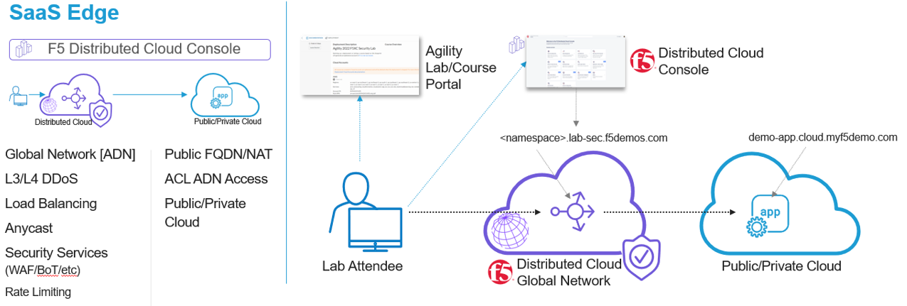
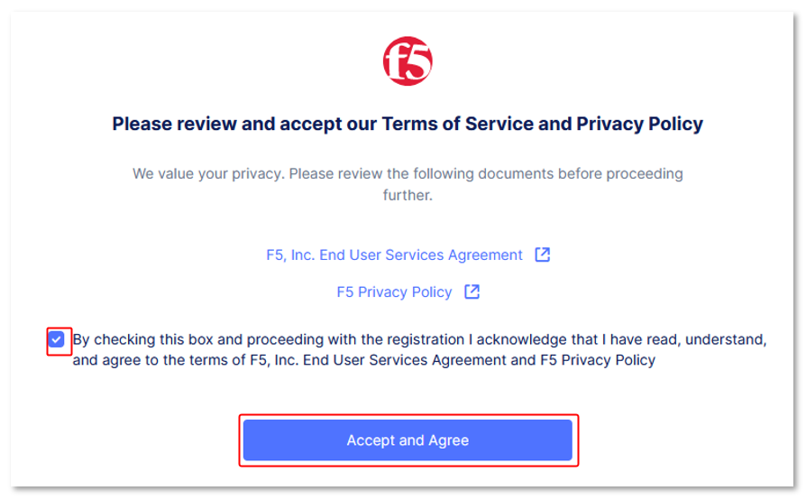
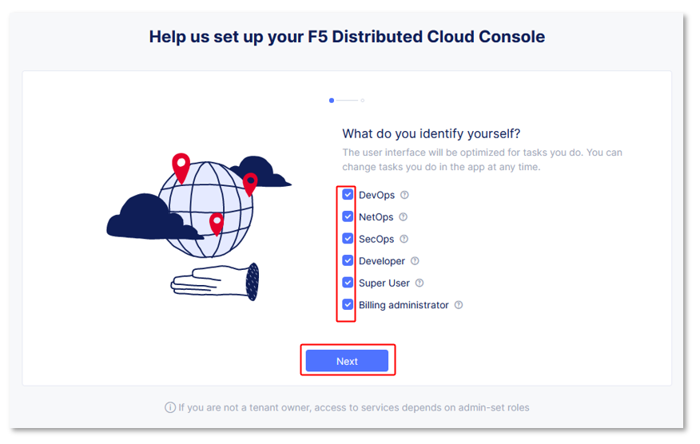
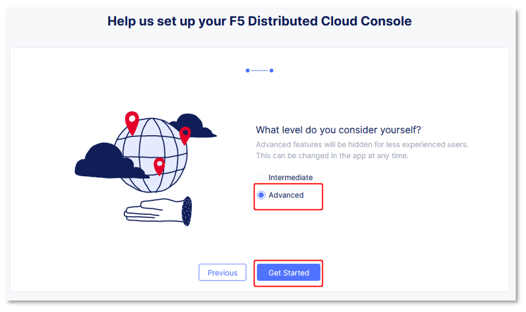
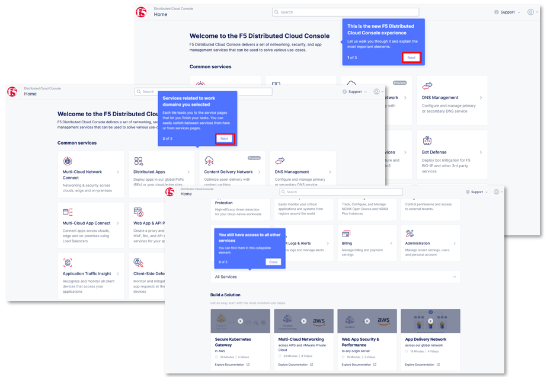
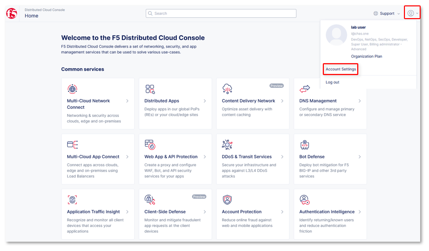
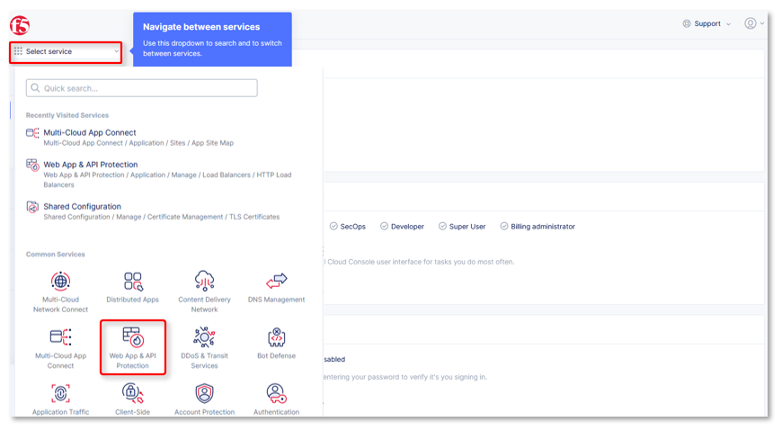
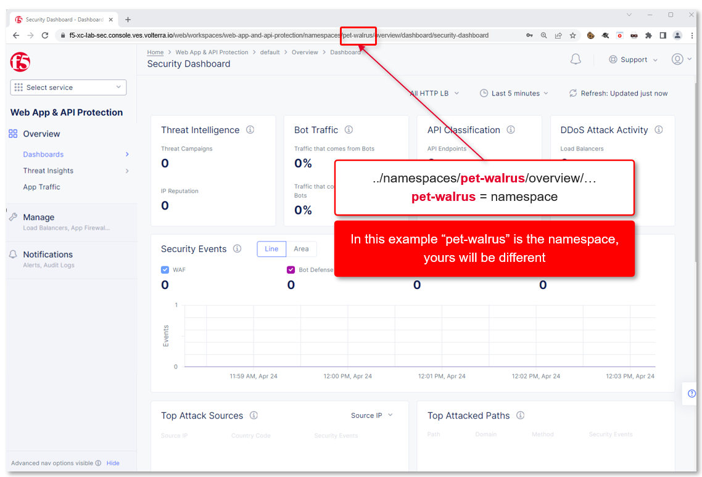

Introduction: Accessing F5 Distributed Cloud Console
====================================================

Welcome to this F5 Distributed Cloud Scenario. The following tasks will guide you
through the initial access requirements for this multi-part Scenario.  Scenario attendees
should have received an invitation (which requests you update your password for
access) email to the Scenario environment. Please check the email address used for
course registration and its associated spam folders to see if the invitation
email has been received.  If you have not received an email, please contact a
member of the Scenario team.

The F5 Distributed Cloud Console, where a majority of all Scenario tasks will be
conducted, is a SaaS based control-plane for services which provides a GUI and
API for managing network, security, and compute services. The F5 Distributed
Cloud Console can manage "sites" in existing on-premises, private data centers
and sites within AWS, Azure, and GCP public cloud environments.

Task 1: Scenario Environment
~~~~~~~~~~~~~~~~~~~~~~~~~~~~

The image below represents an overview of the Scenario environment. F5 Distributed
Cloud Services will be configured as a SaaS Edge delivery and security service
tier to a publicly hosted web application. The key elements Scenario attendees will
interact with are as follows:

* F5 Distributed Cloud Console
* F5 Distributed Cloud Global Network / Application Delivery Network (ADN)
* Publicly hosted application (Public Cloud)

|intro001|

Task 2: F5 Distributed Cloud Console Login
~~~~~~~~~~~~~~~~~~~~~~~~~~~~~~~~~~~~~~~~~~

The following will guide you through the initial Scenario environment access within
the F5 Distributed Cloud Console.  You should have received an email with an
invitation to access a F5 Distributed Cloud Tenant. The email will come from
**no-reply@cloud.f5.com**.

The name of the F5 Distributed Cloud tenant that we will be using for this Scenario
is **f5-xc-Scenario-sec**. Additionally, the following are key configuration
elements for this Scenario and will be used throughout the Scenario tasks that follow.

* F5 Distributed Cloud Console: https://f5-xc-Scenario-sec.console.ves.volterra.io/
* Delegated Domain: **Scenario-sec.f5demos.com**

After following the invitation email's instructions to **Update Password**,
proceed to the first step below to access the F5 Distributed Cloud Scenario Tenant.

#. Please log into the F5 Distributed Cloud Scenario Tenant with your user ID
   (email) & password.

  - https://f5-xc-Scenario-sec.console.ves.volterra.io/

#. When you first login, accept the Scenario tenant EULA. Click the check box and
   then click **Accept** and **Agree**.

#. Select all work domain roles and click Next to see various configuration
   options.

   - Roles can be changed any time later if desired.

#. Click the Advanced skill level to expose more menu options and then click
   Get Started to begin. You can change this setting after logging in as well.

#. Several Guidance ToolTips will appear, you can safely close these as they
   appear.

   |intro002|

   |intro003|

   |intro004|

   |intro005|

#. You can adjust your work domains and skill level (not required) by clicking
   on the Account icon in the top right of the screen and then clicking on
   Account Settings.

#. In the resulting window you can observe the Work domains and skill level
   section and other administrative functions.

   .. note::
      *For the purposes of this Scenario, permissions have been restricted to Scenario
      operations. As **some menus will be locked and not visible.*

   |intro006|

   |intro007|

#. Namespaces, which provide an environment for isolating configured
   applications or enforcing role-based access controls, are leveraged within
   the F5 Distributed Cloud Console. For the purposes of this Scenario, each Scenario
   attendee has been provided a unique **namespace** which you will be
   defaulted to (in terms of GUI navigation) for all tasks performed through
   the course of this Scenario.

#. Click on the **Select Service** in the left-hand navigation. In the
   resulting fly out navigation, click **Web App & API Protection**.

#. In the **Web App & API Protection** configuration screen observe the URL. In
   the URI path, locate the **<adjective-animal>** namespace that you have been
   assigned. It will be located in the portion of the URI path between
   */namespaces/* and */overview/* as shown in this example
   **…/namespaces/<namespace>/overview/…**. Note the namespace as it will be
   used throughout the Scenario tasks that follow.

   .. note::
      *Administratively, there are other ways to find namespaces. Due to access
      and permission* *restrictions for this particular Scenario, those menus are not
      avaiScenariole.*

   |intro008|

   |intro009|

**Beginning of Scenario:**  You are now ready to begin the Scenario, Enjoy! Ask question
as needed.

|Scenariobgn|

.. |intro007| image:: _static/intro-007.png
   :width: 800px

.. |labbgn| image:: _static/Scenariobgn.png
   :width: 800px
